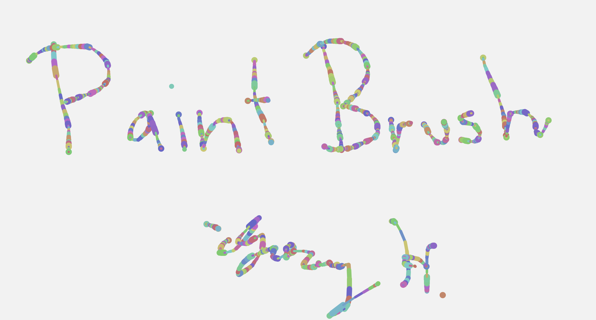

    

<h1 align="center">Paint Brush</h1>

The program allows you to freely draw in the canvas with a Rainbow Brush.  

### 🖌🖼 Project idea: Painting Apllication
## 🌟 Features

- 💻 The program runs on only Javascript
- 💻 Implementation of fundamentals of Programming.

## 📂 Technologies Used

### Game

- Javascript

## ✅ Task

Use the mouse to freely draw and enjoy.

## 📌 Authors

🧑🏽‍💻 **Giovanny Hernandez** 

